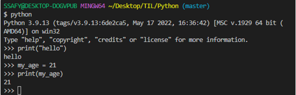

# 23/01/16 프로그래밍과 데이터

# 프로그래밍

- **소프트웨어 == 컴퓨터에게 일시키는 도구**
- 남들과 다른 일을 시키고 싶다면 > **소프트웨어를 개발**
- 소프트웨어를 개발하기 위한 과정
- 컴퓨터에게 명령하는 **적절한 수행 절차를 정의**하고 이를 **프로그래밍 언어로 표현**하는 과정
  
  

### 프로그래밍 과정

1. 컴퓨터에게 시키고 싶은 일을 정한다.
   - 계산(Computation)
   - 저장
2. 컴퓨터가 이해할 수 있도록 수행 절차를 정의해서 표현한다.
   - 어떻게 생각하고 이해?
   - 어떻게 일을 처리?
   - 수행 절차를 어떻게 표현?
   - 자료구조, 컴퓨터 구조, 네트워크, 프로그래밍 언어론, 이산수학, 알고리즘 등을 공부
3. **적절한 프로그래밍 언어를 선택**하고, 언어를 이용해서 절차를 기술한다.
   - Python : 정말 쉽게 많은 것을 할 수 있는 언어
4. 발생하는 오류를 수정한다.
   - 구문 오류(syntax error) - 문법 X > 실행 X
   - 논리 오류(semantic error) - 문법 O / 실행 O > but 결과 X
     
     

### 프로그래밍 잘하는 법

- 컴퓨터적 사고(Computational Thinking)를 잘하면 된다.
- **Computational Thinking** : 컴퓨터가 효과적으로 수행할 수 있도록 문제를 정의하고 그에 대한 답을 기술하는 것이 포함된 사고 과정 일체를 일컫는다
1. 컴퓨터의 특성을 잘 이해한다.(understanding computer)
2. 문제 해결 능력을 기른다.(problem solving, 논리적 사고==작은 문제로 쪼개기)
3. 프로그래밍 언어에 능숙해 진다.(trial & error)
   
   

# Python 시작하기

### 프로그래밍 언어란?

- 기계어로 소통 - 0과 1로 모든 것을 표현(2진법)
- 기계어의 대안으로 사람이 이해할 수 있는 새로운 언어 개발 > **프로그래밍 언어**
- 프로그래밍 언어의 특징
  - 사람이 이해할 수 있는 문자로 구성
  - 기본적인 규칙과 문법이 존재
    
    

### 프로그래밍 언어의 구성

- 소스코드 : 프로그래밍 언어로 작성된 프로그램
- 번역기(interpreter or compiler)
  - 소스 코드를 컴퓨터가 이해할 수 있는 기계어로 번역
  - 파이썬의 경우 인터프리터를 사용
    
    

### 파이썬의 특징

- 다른 프로그래밍 언어에 비해 문법이 간단하며, 엄격하지 않음
- 별도의 데이터 타입 지정이 필요 없으며, 재할당이 가능함
- 문장을 구분할 때 중괄호를 사용하지 않고 들여쓰기를 사용함
- 소스코드를 기계어로 변환하는 컴파일 과정 없이 바로 실행이 가능함
- 객체 지향 프로그래밍 언어로 모든 것이 객체로 구현되어 있음
  
  

### Python 개발환경

- 홈페이지 가서 **3.9.12**설치
- **add python.exe to PATH** 체크하기
- 최신버전? X > 안정적인 버전 사용!
  
  

> **파이썬(python) 인터프리터**

- 아래 사진의 >>> 에 코드를 한 줄 짜면 실행됨

> **파이썬 파일로 실행하기**

- 코드가 길어지면 한 줄 씩 입력하는 것은 무리가 있음
- **.py** 라는 확장자를 가진 파이썬 파일 작성
- Git Bash 실행하고, cd desktop(엔터) python {실행할 파이썬 파일 이름}.py
  
  

> **VS Code 설치하기**

- 메모장인데, 개발에 편한 기능이 들어있음
- 확장프로그램(extension)을 통해 더 많은 기능을 부착해서 나만의 개발환경을 만들 수 있음
- ‘파이썬 VSCode 확장 프로그램 추천’ 검색
  
  

> **파이썬 개발 환경의 종류**

- IDE(intergrated Development Environment)
  - 통합 개발 환경의 약자로 개발에 필요한 다양하고 강력한 기능들을 모아둔 프로그램
  - 보통 개발은 IDE로 진행
    
    

- Jupyter Notebook
  - 문법 학습을 위한 최적의 도구로, 소스 코드와 함꼐 실행 결과와 마크다운 저장 가능
  - open source 기반의 웹 플랫폼 및 어플리케이션으로, 파이썬을 비롯한 다양한 프로그래밍 언어를 지원하며 셀 단위의 실행이 가능한 것이 특징
  - 코딩
    - 파이썬 : Jupyter Notebook & Visual Studio Code
    - 웹 : Visual Studio Code
      - HTML/CSS, Django, Javascript, Vue 등 모두 개발하기 편한 환경
    - 알고리즘 : Pycharm
      
      

- IDLE(Intergrated Development and learning Environment)
  
  

# Python 기초 문법

## 변수와 식별자(Variable & Identifiers)

### 변수(Variable)

- 데이터를 저장하기 위해서 사용
- 변수를 사용하면 복잡한 값들을 쉽게 사용할 수 있음(추상화)
- 동일 변수에 다른 데이터를 언제든 할당(저장)할 수 있기 떄문에 ‘변수’라고 불림
  
  

> **추상화(변수를 사용해야 하는 이유)**

- 일일이 값을 넣는 것이 불편함 - 숫자를 입력하다가 오타가 나서 잘못된 값을 넣을 수 있음
- 코드를 알아보기 힘듦 - 다른 사람이 코드를 이해할 수 없음
- 고치기 어려운 코드
  - 만약 아메리카노 가격이 2000>2500으로 변경된다면? - 코드 여러 곳을 수정해야함
- 코드의 가독성 증가
- 숫자를 직접 적지 않고, 의미 단위로 작성 가능
- 코드 수정이 용이해짐 - 아메리카노 가격이 변경되더라도 1곳만 수정하면 됨
  
  

> **변수의 할당**

- 변수는 할당연산자(=)를 통해 값을 할당(assignment)
- 같은 값을 동시에 할당할 수 있음
- 다른 값을 동시에 할당할 수 있음
  
  

### 식별자(Identifiers)

- 변수의 이름을 식별자라고 함(변수, 함수, 클래스…)
- 변수의 이름을 어떻게 지어야 할까?
- 읽기 쉽고 이해하기 쉬운 변수명이 최고임
- 하지만 전 세계의 개발자들이 약속한 규칙이 있음(최소한의 선)
  
  

> **변수 이름 규칙**

- 식별자의 이름은 영문 알파벳, 언더스코어(_), 숫자로 구성
- 첫 글자에 숫자가 올 수 없음
- 길이 제한이 없고, 대소문자를 구별
- 다음의 키워드(keywords)는 예약어(reserved words)로 사용할 수 없음
- 내장 함수나 모듈 등의 이름도 사용하지 않아야 함
  - 동작을 예상 할 수 없게 임의로 값을 할당하게 되므로 범용적이지 않은 코드가 됨
    
    

> **주석(comment)**

- 코드의 실행에 영향을 미치지 않는 나만의 메모
- 여러줄도 가능함
- ‘**주석다는 습관을 들이자’**
  - 코드에 대한 쉬운 이해
  - 유지보수 용이
  - 협업 용이
  - 내 기억력 믿지마라
    
    

## 연산자(Operator)

- 산술연산자(Arithmetic Operator)
  
  - 기본적인 사칙연산 및 수식 계산
    
    | 연산자 | 내용   |
    | --- | ---- |
    | +   | 덧셈   |
    | -   | 뺄셈   |
    | *   | 곱셈   |
    | /   | 나눗셈  |
    | //  | 몫    |
    | **  | 거듭제곱 |

## 

## 자료형(Data type)

### 자료형과 메모리

- 데이터 10을 컴퓨터가 기억하는 과정
  
  1. 10을 저장할 공간을 메모리에 만들고
  2. 저장할 공간에 대한 주소를 할당받는다
  3. 할당 받은 주소를 기억했다가**(4021555423)**
  4. 10이라는 데이터를 해당 주소로 찾아가서 저장한다
  5. 이후에 10이 필요해지면 해당 주소로 가서 읽어온다

- 기억하기 쉬운 이름으로 바꿔서 부르자! (**4021555423 > 변수)**
  
  - 변수 선언(variable declaration) - 대부분읜 프로그래밍에서 가장 먼저 하는 일

- **프로그래밍에서 변수는 메모리의 주소를 기억하는 이름이다**

- 우리는 변수를 이용해서 데이터를 기억한다

- 자료형 마다 차지하는 메모리의 크기가 다르다

- **id()** :주소 값을 알려주는 함수
  
  

> **자료형의 분류**

- 수치형(Numeric Type)
  - int(정수, integer)
  - float(부동소수점, 실수, floating point number)
  - complex(복소수, complex number)
- 문자열(String Type)
- 불린형(Boolean Type)
- None
  
  

### 수치형(Numeric Type)

> **정수 자료형(int)**

- 0, 100, -200과 같은 정수를 표현하는 자료형
- 여러 진수 표현 가능
  
  

> **실수 자료형(float)**

- 2진수로 바꿔서 저장할려면 무한대로 반복됨 > **부동소수점 사용**
- 실수의 값을 처리할 때 의도하지 않은 값이 나올 수 있음
  - 값 비교하는 과정에서 정수가 아닌 실수면 주의할 것
    - 매우 작은 수 보다 작은지를 확인하거나 math 모듈 활용
      
      

### 문자열 자료형(String Type)

- 모든 문자는 str타입
- 문자열은 작은 따옴표(’)나 큰따옴표(”)를 활용하여 표기
  - 문자열을 묶을 때 동일한 문장부호를 활용
    
    

> **중첩 따옴표**

- 따옴표 안에 따옴표를 표현할 경우
  - 작은 따옴표가 들어있는 경우 큰따옴표로 문자열 생성
  - 그 반대도 가능
    
    

> **삼중 따옴표(Triple Quotes)**

- 작은따옴표나 큰따옴표를 삼중으로 사용
  - 따옴표 안에 따옴표를 넣을 때
  - 여러 줄을 나눠 입력할 때 편리
    
    

> **Escape sequence**

- 역슬래시(backslash)뒤에 특정 문자가 와서 특수한 기능을 하는 문자조합(제어 시퀀스)
  
  | 예약 문자 | 내용(의미)            |
  | ----- | ----------------- |
  | \n    | 줄 바꿈              |
  | \t    | 탭                 |
  | \r    | 캐리지 리턴(커서를 맨 앞으로) |
  | \o    | 널(Null)           |
  | \\    | \                 |
  | \’    | 단일인용부호(’)         |
  | \”    | 이중인용부호(”)         |

> **문자열 연산**

- 덧셈
  
  - 숫자형 연산 7+6은 13
  - 그럼 문자열 끼리 더하면? 파이썬에서 문자열 덧셈은 문자열을 연결
  - 영어로는 String Concatenation이라고 함
    
    

- 곱셈
  
  - 2*3은 2+2+2랑 같고, 결과는 6
  - 문자열 “Python”*3은? == PythonPythonPython
    
    

### None

- 파이썬 자료형 중 하나
- 값이 없음을 표현하기 위해 None 타입이 존재
- 일반적으로 반환 값이 없는 함수에서 사용하기도 함
  
  

### 불린형(Boolean)

- 논리 자료형으로 참과 거짓을 표현하는 자료형
- True 또는 False를 값으로 가짐
- 비교/논리 연산에서 활용됨
  
  

> **비교연산자**

- 수학에서 등호와 부등호아 동일한 개념
- 주로 조건문에 사용되며 값을 비교할 때 사용
- 결과는 True/False 값을 반환함

| 연산자    | 내용                             |
| ------ | ------------------------------ |
| <      | 미만                             |
| < =    | 이하                             |
| >      | 초과                             |
| > =    | 이상                             |
| ==     | 같음                             |
| ! =    | 같지않음                           |
| is     | 객체 아이덴티티(OPP) - 메모리 공간까지 동일하니? |
| is not | 객체 아이덴티티가 아닌 경우                |

> **논리 연산자**

- 여러가지 조건이 있을 때
  
  - 모든 조건을 만족하거나 (And), 여러 조건 중 하나만 만족해도 될 때(or) 특정 코드를 실행하고 싶을 때 사용
  - 일반적으로 비교연산자와 함께 사용됨
  
  | 연산자     | 내용                         |
  | ------- | -------------------------- |
  | A and B | A 와 B 모두 True시, True       |
  | A or B  | A와 B 모두 False시, False      |
  | Not     | True를 False로, False를 True로 |

- 논리 연산자 주의할 점/ not 연산자
  
  - Falsy : False는 아니지만 False로 취급되는 다양한 값
    - 0, 0.0, (), [], {}, None, “”
  - 논리 연산자도 우선순위가 존재
    - not, and, or 순으로 우선순위가 높음 - 괄호사용!

- 논리 연산자의 단축 평가
  
  - 결과가 확실한 경우 두번째 값은 확인하지 않고 첫번째 값 반환
  - and 연산에서 첫번째 값이 False인 경우 무조건 False ⇒ 첫번째 값 반환
  - or 연산에서 첫번째 값이 True인 경우 무조건 True ⇒ 첫번째 값 반환
  - 0은 False, 1은 True
    
    

### 컨테이너

- **컨테이너란?**
  
  - 여러 개의 값(데이터)을 담을 수 이쓴ㄴ 것(객체)으로, 서로다른 자료형을 저장할 수 있음
    - 예시 : List

- **컨테이너의 분류**
  
  - 순서가 있는 데이터 (Ordered) vs. 순서가 없는 데이터(Unordered)
  - 순서가 있다 ≠정려되어 있다
    - **시퀀스형** : 리스트, 튜플, 레인지
    - **비시퀀스형** : 세트, 딕셔너리
      
      

### **시퀀스형**

> **리스트(List)**

- 리스트는 여러 개의 값을 **순서가 있는 구조**로 저장하고 싶을 때 사용

- 리스트의 생성과 접근
  
  - 리스트는 대괄호([]) 혹은 list()를 통해 생성
    - 파이썬에서는 어떠한 자료형도 저장할 수 있으며, 리스트 안에 리스트도 넣을 수 있음
    - 생서된 이후 내용 변경이 가능 → 가변 자료형
    - 이러한 유연성 때문에 파이썬에서 가장 흔히 사용
  - 순서가 있는 시퀸스로 인덱스를 통해 접근 가능
    - 값에 대한 접근은 list[i]
      
      

> **튜플(Tuple)**

- 튜플은 여러 개의 값을 순서가 있는 구조로 저장하고 싶을 때 사용
  
  - 리스트와의 차이점은 생성 후, 담고 있는 값 변경 불가(불변 자료형)

- 항상 소괄호 형태로 사용

- 튜플의 생성과 접근
  
  - 소괄호(()) 혹은 tuple()을 통해 생성
  - 튜플은 수정 불가능한(immutable) 시퀸스로 인덱스로 접근 가능
  - 값에 대한 접근은 my_tuple[i]

- 튜플 생성 주의사항
  
  - 단일 항목의 경우
    - 하나의 항목으로 구성된 튜플은 생성 시 값 뒤에 쉼표를 붙여야 함
  - 복수 항목의 경우
    - 마지막 항목에 붙은 쉼표는 없어도 되지만, 넣는 것을 권장(Trailing comma)
      
      

> **Range**

- 숫자의 시퀸스를 나타내기 위해 사용
- 주로 반복문과 함께 사용됨
- 기본형 : range(n)
  - 0부터 n-1까지의 숫자의 시퀸스
- 범위 지정: range(n,m)
  - n부터 M-1까지의 숫자의 시퀸스
    
    

> **슬라이싱 연산자**

- 시퀸스를 특정 단위로 슬라이싱
  - 인덱스와 콜론을 사용하여 문자열의 특정 부분만 잘라낼 수 있음
  - 슬라이싱을 이용하여 문자열을 나타낼 때 콜론을 기준으로 **앞 인덱스에 해당하는 문자는 포함**되지만 **뒤 인덱스에 해당 문자는 미포**
    
    

### 비시퀀스형

> **딕셔너리(Dictionary)**

- 키-값(key-value)쌍으로 이워진 자료형(3.7부터는 ordered, 이하 버전은 unordered)

- Dictionary의 키(key)
  
  - key는 변경 불가능한 데이터(immutable)만 활용 가능
    - String, integer, float, boolean, tuple, range

- 각 키의 값(values)
  
  - 어떠한 형태는 관계없음

- 딕셔너리 생성
  
  - 중괄호({}) 혹은 dict()을 통해 생성
  - key를 통해 value에 접근
    
    

### 형변형(typecasting)

- 데이터 형태는 서로 변환할 수 있음

- **암시적 형 변환(Implicit)**
  
  - 사용자가 의도하지 않고, 파이썬 내부적으로 자료형을 변환하는 경우
    - bool
    - Numeric type(int, float)

- **명시적 형 변환(Explicit)**
  
  - 사용자가 특정 함수를 활용하여 의도적으로 자료형을 변환하는 경우
    - int
      - str, float ⇒int
      - 단, 형식에 맞는 문자열만 정수로 변환 가능
    - float
      - str(참고), int ⇒ float
      - 단, 형식에 맞는 문자열만 float로 변환 가능
    - str
      - int, float, list, tuple, dict ⇒ str
  
  |            | String | list    | tuple   | range | set     | dictionary |
  |:----------:|:------:|:-------:|:-------:|:-----:|:-------:|:----------:|
  | String     |        | O       | O       | X     | O       | X          |
  | list       | O      |         | O       | X     | O       | X          |
  | tuple      | O      | O       |         | X     | O       | X          |
  | range      | O      | O       | O       |       | O       | X          |
  | set        | O      | O       | O       | X     |         | X          |
  | dictionary | O      | O(key만) | O(key만) | X     | O(key만) |            |
