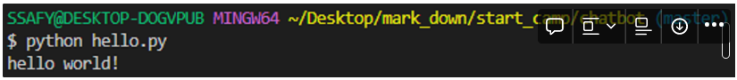

# 23/01/12 VScode

### open source

- 기술 이해만 있다면 누구든 활용 가능
- Google Tensorflow - Airbnb, Xiaomi
- AWS - Pinterest, Netflix
- IBM Watson - Legends, Minter Ellison

### VScode

- VScode는 마이크로소프트에서 개발한 코드 에디터의 한 종류

- Windows, Mac, Linux를 모두 지원수업 내용

- 기존 개발 도구들 보다 가볍고 빠르고, 점유율이 높은 에디터

- 무한한 확장성
  
  - SSAFY에서 사용하게 될 python, html, css, javascript를 모두 다룰 수 있음
    
    
    
    git bash 선택

  

- VScode > F1 > user setting(JSON) > 아래의 코드 입력

```python
# setting.json
{
"terminal.integrated.defaultProfile.windows": "Git Bash",

"http.proxy": "",
"http.proxyStrictSSL": true,
"http.proxyAuthorization": null
}
```
